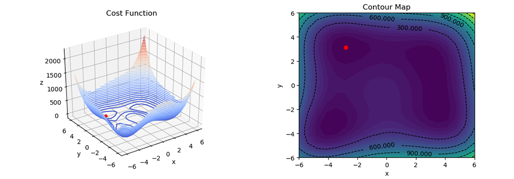

# Gradient Descent

This is a Python implementation of the gradient descent algorithm. Gradient descent is an optimization algorithm for minimizing a given cost function, most commonly used in machine learning.


## Initialization of the algorithm

* Define the cost function to be minimized
* Define the derivative of the cost function
* Set the learning rate which controls the rate of change of the value
* Set the starting location at a specific point

## Explanation of the update on each iteration

On every iteration we calculate the location of the next point using the following formulae:

```Python
nextPoint = point - learning_rate * derivative(point)
```

Calculating the derivative of a specific point on the cost function, we can find the slope (or gradient) of the function at this specific location. This gradient transaltes to the direction of the steepest ascent. Having this in mind, we substact this value from the last location, to find the steepest descent that we need for the gradient descent algorithm.

## Three dimensions and multivariable functions



When the cost function takes more than one parameters (known as multivariable functions), things change a bit. For instance the function

```Python
f(x, y) = x**2+y**2
```

takes two parameters, x and y, and outputs one value. If x and y parameters represent values on the x and y axes, then the output value, let's call it z, could be the z axis.

Following the same approach as before, we need to calculate the derivative. In order to calculate the derivative of a multivariable function, we need to calculate its partial derivatives with respect to each and every one of the parameters.

For this specific example we can calculate the partial derivatives as follows:

```Python
dfdx = 2 * x  # Partial derivative with respect to the x parameter
dfdy = 2 * y  # Partial derivative with respect to the y parameter
```

Keeping all these in mind, now we can iterate and update the location as such:

```Python
nextPoint[] = [point - derivative_x(point) * a - point - derivative_y(point) * a]
```

Important! Notice that now we are getting and saving vectors instead of single values. This happens because on every iteration, we need to calculate the gradient (or slope) towards both the x axis and the y axis.

## Prerequistes

1) [Python 3](https://www.python.org/downloads/)
2) [NumPy](http://www.numpy.org/)
3) [Matplotlib](http://matplotlib.org/)

For your convenience there is a file named requirements, which holds the information about all the required libraries. After making sure you have python up and running in your machine, you can install all the requirements by using the following command:

```Python
pip install -r requirements.txt
```
