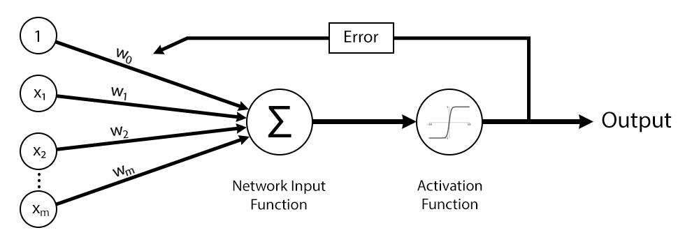
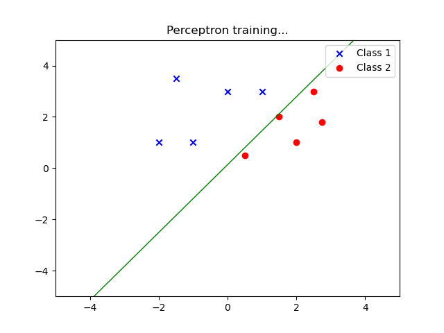

# Perceptron Neural Network

This is a Python implementation of a single layer Perceptron. A perceptron is an artificial neuron, which can only solve linearly separable problems.



A perceptron owns the following properties:

* Feed-forward neural network with a single layer
* Used for supervised learning
* Represents a binary classifier, type of linear classifier
* Deals with the training of weights

With this implementation you can interact in real time with the perceptron. More specifically you can:

1. See current weights of the perceptron

2. Train the Perceptron with a given dataset

3. Give a test value to the perceptron and get a guess

## Training

During the training phase, there is a plot explaining what is going. Throughout the epochs, one can see how the line is changing, until ultimatelly finds a location that can linearly classify the two classes.



Currently there are two datasets inside the "dataset" folder. The user has the option to choose between a custom random dataset and the popular "iris" dataset.

Your can read more about the "Iris" dataset by clicking at the following link:

* [Iris Data Set](https://archive.ics.uci.edu/ml/datasets/Iris)

## Prerequistes

1) [Python 3](https://www.python.org/downloads/)
2) [NumPy](http://www.numpy.org/)
3) [Matplotlib](http://matplotlib.org/)

For your convenience there is a file named requirements, which holds the information about all the required libraries. After making sure you have python up and running in your machine, you can install all the requirements by using the following command:

```Python
pip install -r requirements.txt
```
